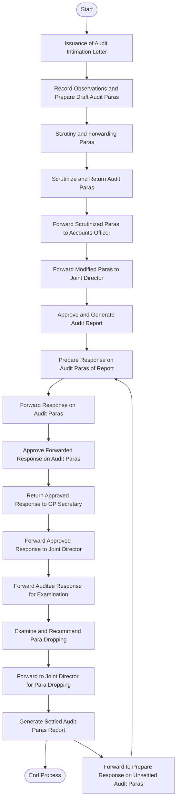

# Designing a Workflow for Local Fund Audit: Village Panchayat Audit Process Using Mermaid Flowcharts

A well-defined audit workflow is essential for ensuring transparency, accountability, and timely completion of statutory audits. For the **Directorate of Local Fund Audit (DLFA), Government of Sikkim**, documenting the audit lifecycle in a visual format helps auditors, supervisors, and auditee institutions understand their responsibilities at every stage.

This article demonstrates how to convert a traditional audit workflow into a **Mermaid flowchart**, making it suitable for GitHub Pages, documentation portals, training manuals, and knowledge repositories.

---

# Why Document Audit Workflows?

Traditional workflow documents are often difficult to follow because they are presented as long tables or textual procedures.

Visual workflows offer several advantages:

* Easy to understand
* Clearly identifies responsibility at each stage
* Simplifies training of new auditors
* Standardizes audit procedures
* Suitable for Audit Management Systems
* Can be embedded directly in Markdown documentation

---

# Overview of the Village Panchayat Audit Workflow

The audit process consists of two major phases:

1. **Audit Execution**
2. **Settlement of Audit Paras**

The workflow involves two sets of stakeholders.

## Auditors

* Accounts Clerk
* Junior Accountant
* Accountant
* Senior Accountant
* Accounts Officer
* Senior Accounts Officer
* Joint Director

---

## Auditees

* GP Secretary
* Panchayat

---

# Stage 1 – Audit Initiation

The process begins with issuing an official audit intimation letter.

**Responsible Officers:** Accounts Clerk, Junior Accountant, Accountant, or Senior Accountant.

This informs the Gram Panchayat regarding:

* audit schedule
* records to be produced
* audit team
* expected cooperation

---

# Stage 2 – Field Audit

After arrival at the Gram Panchayat office, auditors examine:

* Cash Book
* Bank Reconciliation
* Receipts
* Payment Vouchers
* Grants
* Scheme Records
* Procurement Records
* Asset Registers
* Advances
* Utilization Certificates

Observations are converted into **Draft Audit Paras**.

**Responsible Officials:** Accounts Clerk, Junior Accountant, Accountant, or Senior Accountant.

---

# Stage 3 – Internal Scrutiny

Draft audit observations undergo internal scrutiny.

**Performed By:** Accounts Officer or Senior Accounts Officer.

The objectives are:

* verify facts
* remove duplication
* improve drafting
* ensure legal references
* maintain consistency

---

# Stage 4 – Revision of Audit Paras

If corrections are required, the draft is returned.

**Handled By:** Accountant or Senior Accountant.

Necessary modifications are incorporated before resubmission.

---

# Stage 5 – Forwarding to Joint Director

After scrutiny, the Accounts Officer or Senior Accounts Officer forwards the finalized draft to the **Joint Director**.

---

# Stage 6 – Approval of Audit Report

The Joint Director:

* reviews observations
* approves audit paras
* finalizes the report
* authorizes report generation

The official audit report is then issued.

---

# Stage 7 – Auditee Response

Upon receiving the report, the Gram Panchayat begins preparing replies.

## GP Secretary

Responsibilities include:

* examine audit observations
* collect supporting documents
* prepare replies
* compile compliance reports

---

## Panchayat

The Panchayat:

* reviews responses
* approves replies
* authorizes submission

After approval, the response is returned to the GP Secretary.

---

# Stage 8 – Submission to Directorate

The GP Secretary forwards the approved response to the Joint Director.

The Joint Director forwards it for examination by the Accounts Officer or Senior Accounts Officer.

---

# Stage 9 – Examination of Compliance

The examining officers verify:

* documentary evidence
* financial corrections
* compliance with rules
* recovery made
* procedural improvements

Each audit para is categorized as **Settled**, **Partially Settled**, or **Not Settled**.

---

# Stage 10 – Recommendation for Para Dropping

Where compliance is satisfactory, the Accounts Officer and Senior Accounts Officer recommend dropping the audit para.

Recommendations are forwarded to the Joint Director.

---

# Stage 11 – Settlement Report

The Joint Director reviews recommendations and generates the **Settled Audit Paras Report**, officially closing the complied audit observations.

---

# Stage 12 – Unsettled Audit Paras

Not every audit para is settled immediately. Remaining observations are returned to the **GP Secretary**, and the process repeats until satisfactory compliance is achieved, creating a continuous compliance cycle.

---

# Complete Audit Workflow

* **Initiation & Field Audit:** `Audit Intimation` → `Field Audit` → `Draft Audit Paras`
* **Scrutiny & Approval:** `Internal Scrutiny` → `Modification` → `Joint Director Approval` → `Audit Report`
* **Auditee Response:** `GP Secretary Response` → `Panchayat Approval` → `Submission to DLFA`
* **Compliance & Settlement:** `Compliance Examination` → `Recommendation for Para Dropping` → `Settled Audit Paras Report`
* **Follow-up:** `Unsettled Paras` → `GP Secretary Response` (loop until settled)

---

# Mermaid Flowchart

GitHub Pages supports Mermaid diagrams, making it possible to render workflows directly from Markdown.

---

# Responsibilities Matrix

| Stage | Responsibility | Officer |
| --- | --- | --- |
| Audit Intimation | Notify Auditee | Accounts Clerk / Jr Accountant / Accountant / Sr Accountant |
| Field Audit | Record observations | Audit Team |
| Scrutiny | Verify audit paras | Accounts Officer / Senior Accounts Officer |
| Revision | Modify draft | Accountant / Senior Accountant |
| Approval | Final Audit Report | Joint Director |
| Response | Prepare compliance | GP Secretary |
| Approval | Approve response | Panchayat |
| Examination | Verify compliance | Accounts Officer / Senior Accounts Officer |
| Settlement | Drop audit paras | Joint Director |

---

# Benefits of a Digital Workflow

Using Mermaid diagrams and Markdown provides several advantages:

* Version-controlled documentation
* Easy collaboration through GitHub
* Visual process mapping
* Printable audit manuals
* Reusable workflow templates
* Better onboarding of new staff
* Integration with knowledge management systems
* Supports continuous process improvement

---

# Potential Enhancements

This workflow can be extended into a complete Audit Management System by adding:

* Role-based login
* Digital audit checklists
* Online audit para drafting
* Evidence attachment
* Approval workflows
* Dashboard for pending audit paras
* Automatic reminders
* Audit statistics
* Compliance tracking
* PDF report generation
* Digital signatures
* Audit trail logging

---

# Conclusion

A structured and documented audit workflow improves consistency, accountability, and transparency throughout the audit lifecycle. Representing the Village Panchayat audit process as a Mermaid flowchart enables teams to maintain clear documentation that is easy to understand, update, and publish through GitHub Pages.

For organizations implementing digital audit systems, Markdown combined with Mermaid offers a lightweight, maintainable, and developer-friendly approach to documenting business processes while preserving a single source of truth for audit operations.
